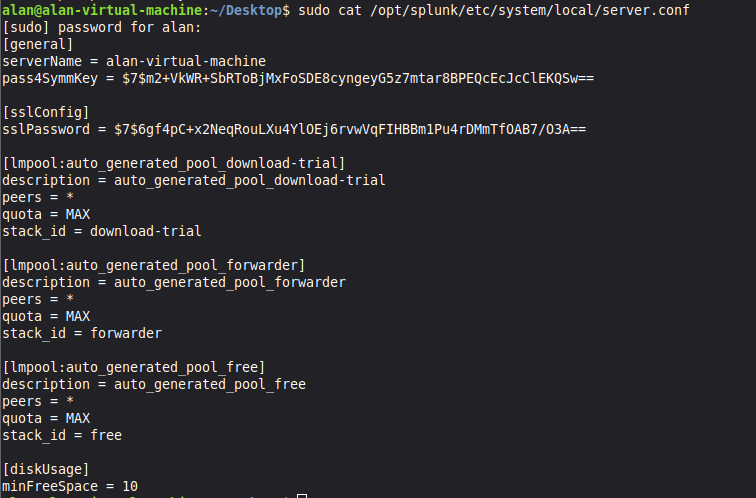
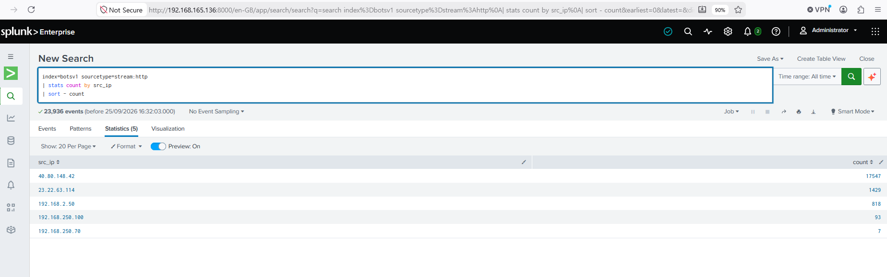
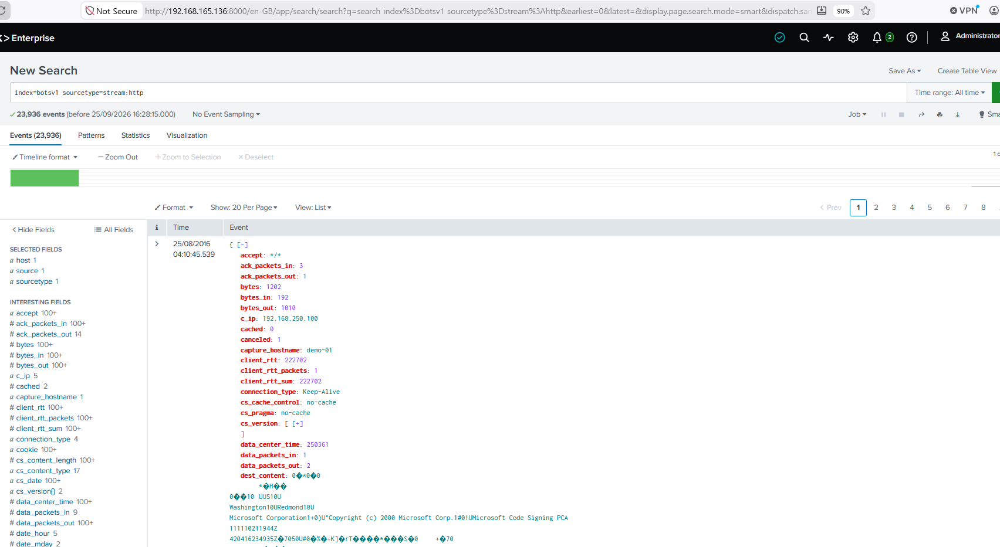
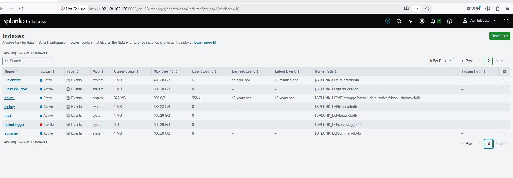

# Splunk Enterprise Security Operations Center (SOC) Home Lab: BOTSv1 Attack Investigation

##  Project Overview
This portfolio project details the deployment of an enterprise-tier SIEM architecture inside a virtualized network environment to ingest multi-vector infrastructure telemetry. Using the Splunk Processing Language (SPL), I investigated a multi-stage automated cyber attack targeting **Wayne Enterprises'** web infrastructure.

##  Architecture & Troubleshooting
* **SIEM Engine:** Splunk Enterprise 10.4.x hosted on a headless Linux Mint server daemon (`192.168.165.136`).
* **Telemetry Fabric:** Ingress Firewalls (`fgt_traffic`), Suricata IDS logs, and Application Wire-Data network stream parsers (HTTP, DNS, SSL).

###  Engineering Challenge: Severe VM Resource Constraints
During initial data ingestion, the Splunk engine halted queries due to a hardcoded `5000MB minimum disk space` safety threshold configuration on the limited 20GB virtual hard disk.
* **Resolution:** Leveraged the Linux CLI via `sudo nano` to securely alter system parameters inside `server.conf`, injecting a performance modifier (`minFreeSpace = 10`) to allow full analytical operations within tightly constrained host resource boundaries.

---

##   Incident Response Phase 1: Reconnaissance & Tool Fingerprinting
### Task 1: Attacking Host Isolation
An analytical search grouping ingress traffic profiles identified an extreme volume of connection queries coming from a single external IP address.
* **SPL Query:** `index=botsv1 sourcetype=stream:http | stats count by src_ip | sort - count`
* **Attributed Threat Actor:** `40.80.148.42` (Responsible for **17,547** aggressive web requests).

### Task 2: Scanner Toolkit Attribution
Granular header analysis revealed that the adversary was running an automated **Acunetix Web Vulnerability Scanner** script attempting directory traversal and SQL Injection payloads, masking their activity by spoofing standard Chrome desktop User-Agents.
* **SPL Query:** `index=botsv1 sourcetype=stream:http src_ip="40.80.148.42" | stats count by http_user_agent | sort - count`

---

##  Incident Response Phase 2: Vulnerability Mapping & Success Verification
### Task 3: HTTP Status Mapping
By checking application response codes, I verified that the threat actor successfully mapped a live **Joomla CMS installation** located at `/joomla/index.php`, aggressively probing its backend core component search endpoints (**10,157 successful hits**).
* **SPL Query:** `index=botsv1 sourcetype=stream:http src_ip="40.80.148.42" | stats count by uri status | sort - count`

### Task 4: Confirming Authentication Bypass / Compromise
Pivot queries targeting the administrative authentication endpoint portal (**`/joomla/administrator/index.php`**) confirmed the adversary launched highly directed HTTP **`POST`** transaction queries, resulting in multiple **HTTP 200 OK successes**—confirming interactive form submittal and potential account compromise.
* **SPL Query:** `index=botsv1 sourcetype=stream:http src_ip="40.80.148.42" uri="/joomla/administrator/index.php" | stats count by http_method status`

